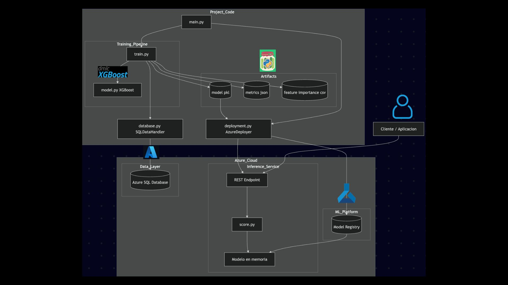

# Azure ML Pipeline – Order Volume Classification

## 📌 Descripción

Este proyecto implementa un sistema completo de Machine Learning utilizando Azure ML SDK y Azure SQL Database. El objetivo es predecir una variable cualitativa (*OrderVolume*) a partir de datos transaccionales, mediante un modelo de clasificación multiclase.

La solución sigue una arquitectura modular orientada a objetos (OOP), donde cada script tiene una única responsabilidad: extracción de datos, entrenamiento, generación de artifacts y despliegue en la nube.

---

## 🏗️ Arquitectura del sistema



El sistema está dividido en varias capas que permiten un flujo completo desde los datos hasta la inferencia en la nube.

---

## 🔹 1. Training Pipeline (`src/`)

Esta capa contiene la lógica de entrenamiento implementada en la clase `OrderClassifier`.

### Componentes:

* `database.py`: conexión a Azure SQL Database mediante `SQLDataHandler`
* `train.py`: implementación del pipeline completo de entrenamiento
* `model.py`: definición del modelo

---

### 🔄 Flujo de entrenamiento

1. **Extracción de datos**
   Se realiza una consulta SQL sobre tablas de ventas (`SalesOrderDetail`, `SalesOrderHeader`, `Product`).

2. **Preprocesamiento**

   * Generación de variables temporales (`day_of_week`, `month`, etc.)
   * Codificación de variables categóricas (`ShipMethod`)
   * Creación de la variable objetivo `OrderVolume` mediante discretización (cuartiles)

3. **Entrenamiento del modelo**

Se utiliza XGBoost con búsqueda de hiperparámetros:

* GridSearchCV (5 folds)
* Clasificación multiclase (4 clases)
* Optimización por accuracy

4. **Evaluación**

   * Accuracy en conjunto de prueba
   * Tamaño de train/test

---

## 🔹 2. Artifacts (`artifacts/`)

Contiene las salidas del entrenamiento:

* `order_classifier.pkl`: modelo entrenado
* `metrics.json`: métricas y mejores hiperparámetros
* `feature_importance.csv`: importancia de variables

Estos archivos permiten reproducir y desplegar el modelo sin necesidad de reentrenar.

---

## 🔹 3. Deployment (`deployment.py`)

Este módulo se encarga de:

* Registrar el modelo en Azure ML
* Configurar el entorno de ejecución
* Desplegar el modelo como un servicio en la nube

---

## 🔹 4. Servicio de inferencia (`API/`)

* `score.py`: define la lógica de inferencia

Funciones clave:

* Carga del modelo (`.pkl`)
* Recepción de datos (JSON)
* Transformación de variables
* Generación de predicciones

Este archivo permite exponer el modelo como un endpoint REST.

---

## 🔹 5. Capa de datos

Se utiliza:

* Azure SQL Database

Permite:

* Acceso remoto a datos
* Integración con pipelines de ML
* Escalabilidad

---

## 🔹 6. Cliente / Aplicación

El modelo desplegado puede ser consumido mediante:

* solicitudes HTTP
* envío de datos en formato JSON
* recepción de predicciones

---

## 🔹 7. Script principal (`main.py`)

Coordina la ejecución del sistema:

```python
if __name__ == "__main__":
```

Con respecto a la pregunta Bonus, este bloque define el punto de entrada del programa. Permite ejecutar el flujo principal únicamente cuando el archivo se ejecuta directamente, evitando que se ejecute automáticamente cuando es importado como módulo en otro script.

En este proyecto, se utiliza para orquestar:

* entrenamiento (opcional)
* evaluación
* despliegue del modelo

---

## ⚙️ Tecnologías utilizadas

* Python
* Azure ML SDK
* Azure SQL Database
* XGBoost
* Scikit-learn
* REST API

---

## 🚀 Ejecución

1. Instalar dependencias:

```bash
pip install -r requirements.txt
```

2. Ejecutar el pipeline:

```bash
python main.py
```

---

## 🎯 Cumplimiento de la actividad

Este proyecto cumple con los requerimientos de la actividad:

* Uso de Azure ML SDK para entrenamiento y despliegue
* Conexión a base de datos SQL remota
* Predicción de variable cualitativa (`OrderVolume`)
* Separación modular (OOP)
* Un script por responsabilidad
* Despliegue en la nube
* Consumo mediante API REST

---

## 🧠 Predicción Cualitativa 

La variable objetivo `OrderVolume` se construye a partir de la variable continua `OrderQty`, discretizándola en cuartiles. Esto permite transformar el problema en una clasificación multiclase balanceada.

---

## 📬 Autor

Proyecto desarrollado para el módulo de **Cloud Computing**.

**Equipo 1:**

Pedro Soto Juárez - A00837560

Alexei Carrillo Acosta - A01285424

Mateo Zepeda Pérez - A01722398

Luis Fernando Alcazar Díaz - A00836287

Erick Isaac Lascano Otañez - A00836571
